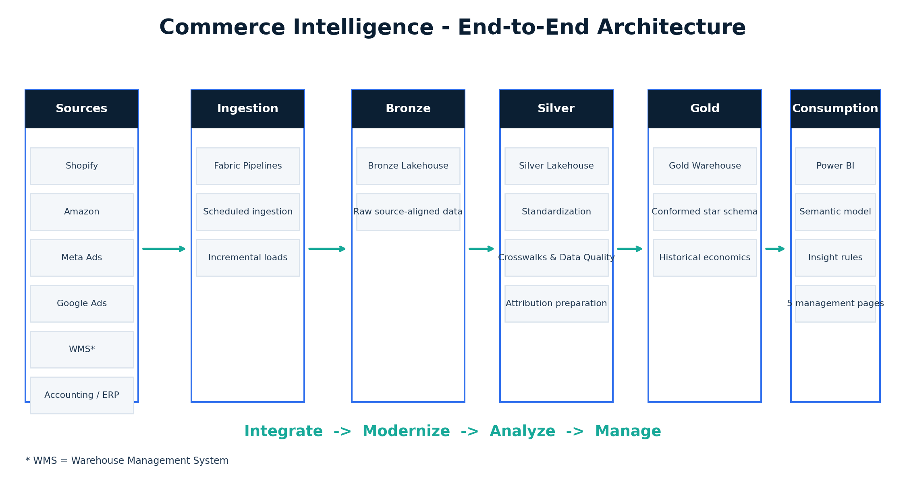
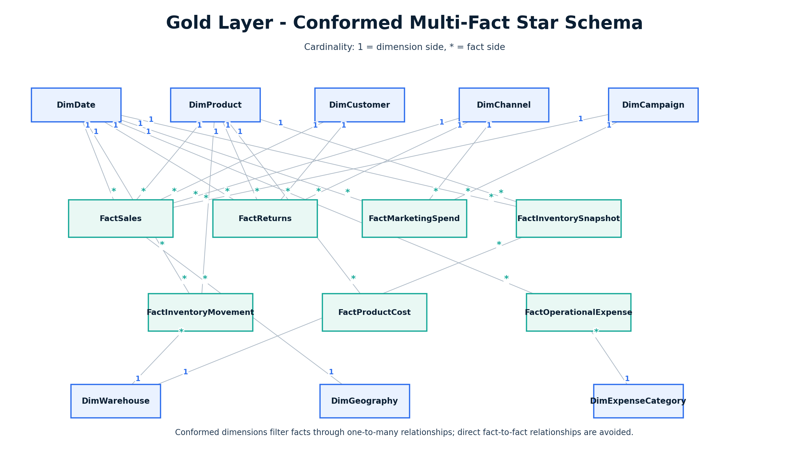
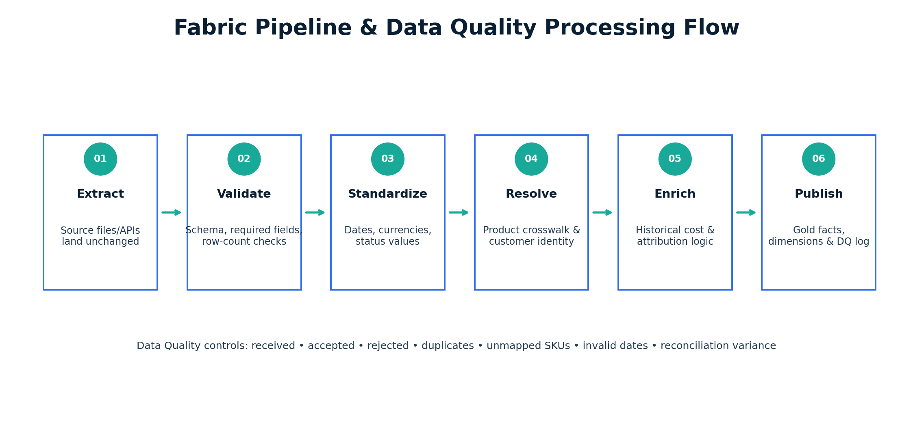
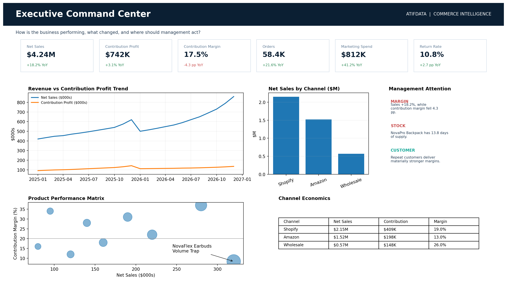
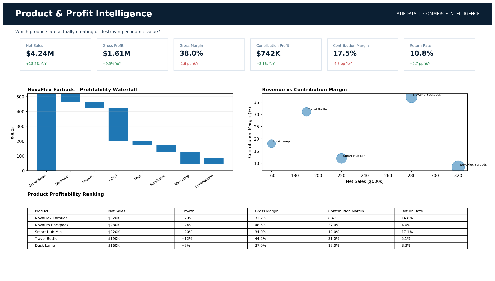
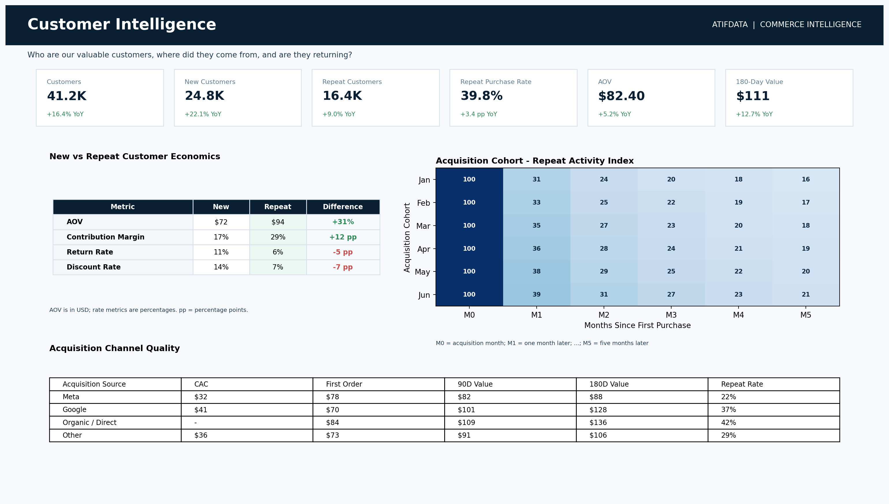
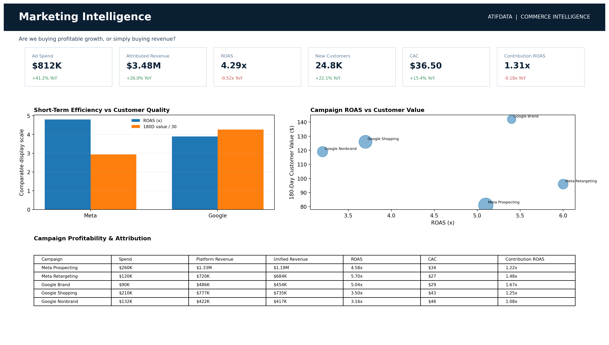
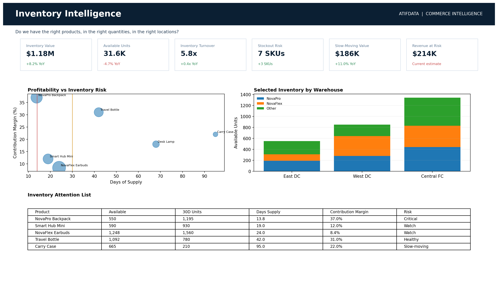
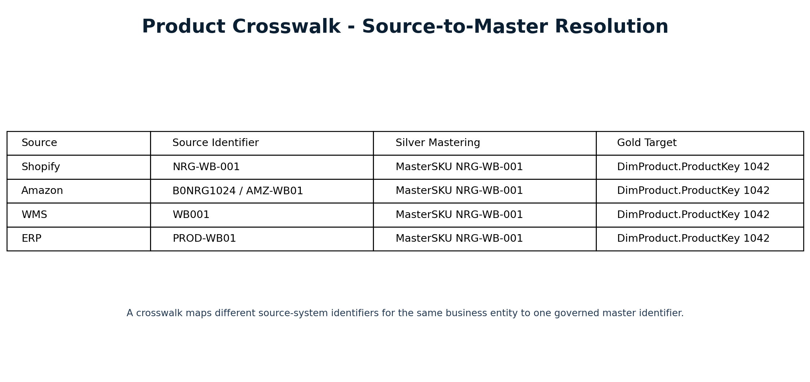
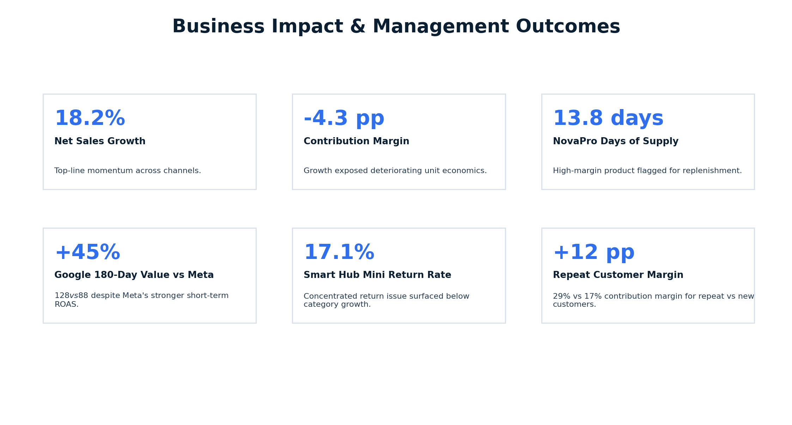

# Commerce Intelligence — Omnichannel Retail Data Modernization & Analytics

Modernized fragmented retail, marketing, customer, inventory, and financial data into a governed Microsoft Fabric analytics platform for profitability, customer value, marketing effectiveness, and inventory decision-making.

# Introduction

This project demonstrates the design of an end-to-end **Commerce Intelligence** platform for an omnichannel retail business operating across Shopify, Amazon, wholesale channels, digital advertising platforms, warehouse systems, and accounting applications.

The solution uses **Microsoft Fabric** to consolidate fragmented source data into a governed Bronze–Silver–Gold architecture. Data quality controls, product crosswalks, historical cost logic, marketing attribution, and conformed dimensional models create a consistent analytical foundation across commerce, marketing, inventory, customer, and finance domains.

A governed **Power BI semantic model** transforms the Gold layer into management-ready analytics across five decision-focused experiences: Executive Command Center, Product & Profit Intelligence, Customer Intelligence, Marketing Intelligence, and Inventory Intelligence.

The result is a unified analytical platform that moves beyond isolated platform reporting and helps management understand where economic value is being created, where margin is being lost, which customers and channels generate long-term value, and where inventory or product risks require action.

# Omnichannel Commerce Intelligence Platform using Microsoft Fabric

## Challenge

- Sales, customer, marketing, inventory, and financial data were distributed across independent operational platforms.
- Shopify, Amazon, wholesale, Meta Ads, Google Ads, WMS, and accounting systems used different identifiers and business definitions.
- Management lacked a consistent cross-channel view of revenue, contribution profitability, customer value, marketing quality, and inventory risk.
- Product identifiers differed between ecommerce, marketplace, warehouse, and ERP systems, making reliable product-level analysis difficult.
- Historical product costs needed to be preserved so past profitability was not recalculated using current costs.
- Returns, discounts, marketplace fees, payment fees, fulfillment costs, and marketing spend needed to be incorporated into a consistent profitability model.
- Short-term advertising metrics did not always reflect the long-term value of acquired customers.
- Management needed actionable insights rather than disconnected KPIs and platform-specific reports.

---

## Solution

- Designed an end-to-end commerce analytics architecture using **Microsoft Fabric**.
- Implemented source-aligned **Bronze**, standardized **Silver**, and governed analytical **Gold** processing layers.
- Integrated data from Shopify, Amazon, wholesale channels, Meta Ads, Google Ads, WMS, and accounting/ERP systems.
- Created governed product crosswalks to resolve different source identifiers into a common **MasterSKU**.
- Implemented data-quality controls for deduplication, required fields, invalid dates, unmapped products, status standardization, currency conversion, late-arriving returns, and reconciliation.
- Designed a conformed multi-fact dimensional model covering Sales, Returns, Marketing Spend, Inventory Snapshot, Inventory Movement, Product Cost, and Operational Expense.
- Preserved historical product economics through effective-dated product cost logic.
- Implemented contribution-profit calculations incorporating COGS, marketplace fees, payment fees, fulfillment costs, and allocated marketing costs.
- Applied a **30-day last non-direct-touch attribution model** while retaining platform-reported attribution for comparison.
- Built a governed Power BI semantic layer and DAX measures for executive and operational analytics.
- Developed deterministic executive insight rules that convert KPI movements into auditable management signals and actions.

---

## Impact

- **18.2% Net Sales Growth** — unified cross-channel analysis highlighted strong top-line momentum.
- **4.3 percentage-point Contribution Margin Decline** — revealed that revenue growth was not translating proportionally into economic value.
- **13.8 Days of Supply on NovaPro Travel Backpack** — identified a high-margin product requiring replenishment attention.
- **45% Higher 180-Day Customer Value from Google vs Meta** — Google-acquired customers generated $128 versus $88 for Meta despite Meta's stronger short-term ROAS.
- **17.1% Return Rate on Smart Hub Mini** — surfaced a concentrated product-quality and returns issue.
- **12 percentage-point Repeat-Customer Margin Advantage** — repeat customers generated a 29% contribution margin versus 17% for new customers.
- Established a governed analytical foundation for cross-functional decision-making across commerce, marketing, customer, inventory, and finance.
- Created an auditable KPI-to-insight-to-action framework for management reporting.

---

## Media

### End-to-End Solution Architecture

### Gold Layer — Conformed Multi-Fact Star Schema

### Fabric Pipeline & Data Quality

---

## Power BI Analytics Experience

### Executive Command Center

Provides an enterprise-level view of growth, profitability, customer economics, marketing performance, and inventory signals.

### Product & Profit Intelligence

Analyzes product-level sales, contribution profitability, discounting, returns, and commercial performance.

### Customer Intelligence

Evaluates customer acquisition cohorts, repeat behavior, long-term customer value, and new-versus-repeat customer economics.

### Marketing Intelligence

Compares marketing efficiency, attribution, ROAS, and long-term customer value across acquisition channels.

### Inventory Intelligence

Connects inventory availability with product economics to identify stockout risk, excess inventory, and replenishment priorities.

---

## Product Crosswalk & Data Governance

A governed crosswalk resolves different product identifiers used across source systems into a single **MasterSKU**. This allows Shopify SKUs, Amazon ASIN/SKU mappings, WMS item codes, and ERP product codes to be analyzed consistently across sales, inventory, returns, costs, and profitability.

---

## Business Impact

The integrated analytical model connects operational data with commercial economics, allowing management to identify growth-quality gaps, high-value customer segments, marketing-channel tradeoffs, product return issues, and inventory risks.

---

# Analytical Model

## Core Dimensions

- Date
- Product
- Customer
- Channel
- Campaign
- Warehouse
- Geography
- Expense Category

## Core Facts

- Sales — one row per order line
- Returns — return events recorded on the actual return date
- Marketing Spend — campaign / platform / day
- Inventory Snapshot — SKU / warehouse / day
- Inventory Movement
- Product Cost — effective-dated historical cost
- Operational Expense

The model follows conformed dimensional-modeling principles and avoids direct fact-to-fact relationships.

---

# Business Logic

## Profitability

**Gross Sales** = Quantity × Original Unit Price

**Net Revenue** = Gross Sales − Discounts − Refunds

**Contribution Profit** = Net Revenue − COGS − Marketplace Fees − Payment Fees − Fulfillment Costs − Allocated Marketing Cost

General operating expenses are maintained separately for company-level operating profitability.

## Marketing Attribution

The core analytical model uses a **30-day last non-direct-touch attribution rule** while retaining platform-reported attribution for comparison.

Where campaigns map to products or categories, marketing cost can be allocated proportionally using attributed net sales.

## Executive Insight Layer

Semantic measures feed deterministic business rules that identify conditions such as:

- Strong revenue growth combined with contribution-margin deterioration.
- High-margin products with fewer than 14 days of supply.
- Marketing channels where short-term ROAS conflicts with 180-day customer value.
- Product or customer patterns requiring management attention.

This creates a transparent **KPI → Insight → Action** workflow.

---

# Tech Stack

## Platform

- Microsoft Fabric
- Microsoft Power BI

## Data Engineering & Analytics

- Fabric Data Factory / Data Pipelines
- Fabric Lakehouse
- Fabric Warehouse
- SQL
- Python
- Power BI Semantic Model
- DAX
- Dimensional Modeling
- Data Quality & Reconciliation

## Data Sources

- Shopify
- Amazon
- Wholesale Channels
- Meta Ads
- Google Ads
- Warehouse Management System (WMS)
- Accounting / ERP Systems

---

## Detailed Documentation

📄 [Project Documentation](AtifData_Commerce_Intelligence_Project_Documentation_v2_2.docx)

📄 [Case Study PDF](AtifData_Commerce_Intelligence_Case_Study_v2_2.pdf)
